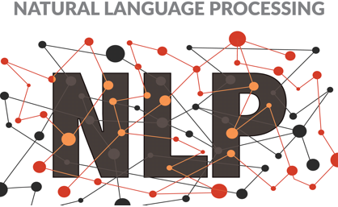

<div align="center">

  

  
 📚  📝 🎥 NLP resources  🎥 📝 📚  
   

</div>

## Directory Tree

```bash
.
├── imeages
│   ├── nlp.png
├── .gitignore
├── README.md
```

1 directories, 3 files

## Natural Language Processing

Natural Language Processing (NLP) is the sub-part of Artificial Intelligence that explores how machines interact with human language. 

Part computer science, part linguistics, part statistics — it can be a challenge deciding where to begin.

Books and online courses are a great place to start!


Online Course/Book                   | Difficulty Level 
------------------------- | ---------------
[Michigan Introduction to NLP🎥][michigannlp]  | 
[Jurafsky and Manning Introduction to Natural Language Processing🎥][jurafskynlp]| 
[NLP - Natural Language Processing with Python🎥][udemynlp]| 
[Modern Natural Language Processing in Python🎥][udemynlp]| 
[cs224n Natural Language Processing with Deep Learning GOLDEN 2019🎥][stanfordnlp2019] |
[cs224u Natural Language Understanding 2019 🎥][stanfordnlu] |
[cmu 2021 Neural Nets for NLP 2021🎥][cmunlp2021]|
[Oxford Natural Language Processing with Deep Learning 2017🎥][oxfordnlp] |
[Jurafsky Speech and Language Processing 📚][jurafskybook]|
[Christopher Manning Foundations of Statistical NLP📚][fsnlp]| 
[Christopher Manning Introduction to Information Retrieval📚][manninginformationr]| 


-------------------------------------------------------------------------------- 
[manninginformationr]: https://nlp.stanford.edu/IR-book/pdf/irbookprint.pdf
[fsnlp]: https://github.com/shivamms/books/blob/master/nlp/Foundations%20of%20Statistical%20Natural%20Language%20Processing%20-%20Christopher%20D.%20Manning.pdf
[jurafskybook]: https://web.stanford.edu/~jurafsky/slp3/
[jurafskynlp]: https://www.youtube.com/watch?v=zQ6gzQ5YZ8o&list=PLoROMvodv4rOFZnDyrlW3-nI7tMLtmiJZ
[cmunlp2021]: https://www.youtube.com/watch?v=vnx6M7N-ggs&list=PL8PYTP1V4I8AkaHEJ7lOOrlex-pcxS-XV
[stanfordnlu]: https://www.youtube.com/watch?v=tZ_Jrc_nRJY&list=PLoROMvodv4rObpMCir6rNNUlFAn56Js20
[michigannlp]:https://www.youtube.com/watch?v=n25JjoixM3I&list=PLLssT5z_DsK8BdawOVCCaTCO99Ya58ryR 
[oxfordnlp]: https://www.youtube.com/watch?v=RP3tZFcC2e8&list=PL613dYIGMXoZBtZhbyiBqb0QtgK6oJbpm
[courseraRL]: https://www.coursera.org/specializations/reinforcement-learning
[sergie2020rl]: https://www.youtube.com/watch?v=JHrlF10v2Og&list=PL_iWQOsE6TfURIIhCrlt-wj9ByIVpbfGc
[cs885]: https://www.youtube.com/playlist?list=PLdAoL1zKcqTXFJniO3Tqqn6xMBBL07EDc
[ucb2018rl]: https://www.youtube.com/watch?v=ue9aS17d5iI&list=PLkFD6_40KJIxJMR-j5A1mkxK26gh_qg37&index=2
[cs330]: https://www.youtube.com/watch?v=0rZtSwNOTQo&list=PLoROMvodv4rMC6zfYmnD7UG3LVvwaITY5
[cs234]: https://www.youtube.com/playlist?list=PLoROMvodv4rOSOPzutgyCTapiGlY2Nd8u
[dsIntrodu]: https://www.youtube.com/watch?v=2pWv7GOvuf0&list=PLqYmG7hTraZDM-OYHWgPebj2MfCFzFObQ
[rlbook]: http://incompleteideas.net/book/RLbook2020.pdf
[Ian]: https://github.com/janishar/mit-deep-learning-book-pdf/blob/master/complete-book-pdf/Ian%20Goodfellow%2C%20Yoshua%20Bengio%2C%20Aaron%20Courville%20-%20Deep%20Learning%20(2017%2C%20MIT).pdf
[fast2]: https://course19.fast.ai/part2
[fast1]: https://course.fast.ai/
[abdeeladv]: https://www.youtube.com/watch?v=V9Roouqfu-M&list=PLwRJQ4m4UJjPiJP3691u-qWwPGVKzSlNP
[durham]: https://www.youtube.com/watch?v=s2uXPz3wyCk&list=PLMsTLcO6etti_SObSLvk9ZNvoS_0yia57
[deepbookexp]: https://www.youtube.com/watch?v=vi7lACKOUao&list=PLsXu9MHQGs8df5A4PzQGw-kfviylC-R9b
[hugodeep]: https://www.youtube.com/watch?v=SGZ6BttHMPw&list=PL6Xpj9I5qXYEcOhn7TqghAJ6NAPrNmUBH
[jeoff]: https://www.youtube.com/watch?v=cbeTc-Urqak&list=PLoRl3Ht4JOcdU872GhiYWf6jwrk_SNhz9
[DeepPy]: https://www.youtube.com/watch?v=0bMe_vCZo30&list=PLLHTzKZzVU9eaEyErdV26ikyolxOsz6mq
[berkley2020]: https://www.youtube.com/watch?v=Va8WWRfw7Og&list=PLZSO_6-bSqHQHBCoGaObUljoXAyyqhpFW
[ucladvrein]: https://www.youtube.com/watch?v=iOh7QUZGyiU&list=PLqYmG7hTraZDNJre23vqCGIVpfZ_K2RZs
[alideep]: https://www.youtube.com/watch?v=fyAZszlPphs&list=PLehuLRPyt1Hyi78UOkMPWCGRxGcA9NVOE
[stanfordnlp2019]: https://www.youtube.com/watch?v=8rXD5-xhemo&list=PLoROMvodv4rOhcuXMZkNm7j3fVwBBY42z
[oxforddeep]: https://www.youtube.com/watch?v=PlhFWT7vAEw&list=RDQMa66mIb9tImc&start_radio=1
[stanfcnn]: https://www.youtube.com/watch?v=vT1JzLTH4G4&list=PL3FW7Lu3i5JvHM8ljYj-zLfQRF3EO8sYv
[cmudeep]: https://www.youtube.com/watch?v=0Oqpax2Q2hc&list=PLp-0K3kfddPzCnS4CqKphh-zT3aDwybDe
[fau]: https://www.youtube.com/watch?v=p-_Stl0t3kU&list=PLpOGQvPCDQzvgpD3S0vTy7bJe2pf_yJFj
[18standeep]: https://www.youtube.com/watch?v=PySo_6S4ZAg&list=PLoROMvodv4rOABXSygHTsbvUz4G_YQhOb
[talkie]: https://www.youtube.com/watch?v=vFYkyk_GmWM&list=PLhb1t0L7sKy2q7on_7dpgOACs3qpNbfkR&index=2
[ucl2020]: https://www.youtube.com/watch?v=7R52wiUgxZI&list=PLqYmG7hTraZCDxZ44o4p3N5Anz3lLRVZF
[boyd]: https://web.stanford.edu/~boyd/cvxbook/bv_cvxbook.pdf
[cmuopti]: https://www.youtube.com/watch?v=Di9f47LAzHQ&list=PLRPU00LaonXQ27RBcq6jFJnyIbGw5azOI
[cmuadvopti]: https://www.youtube.com/watch?v=yBO4E1FARaA&list=PLjTcdlvIS6cjdA8WVXNIk56X_SjICxt0d
[stanfordopti]: https://www.youtube.com/watch?v=McLq1hEq3UY&list=PL3940DD956CDF0622
[calcbok]: http://index-of.co.uk/Mathematics/Calculus%20-%20J.%20Stewart.pdf
[princeton]: https://www.youtube.com/watch?v=uDByROsGzuk&list=PLGqzsq0erqU7h6_bpE-CgJp4iX5aRju28
[multi07]: https://www.youtube.com/watch?v=PxCxlsl_YwY&list=PL4C4C8A7D06566F38
[strangcalc]: https://www.youtube.com/watch?v=X9t-u87df3o&list=PLBE9407EA64E2C318
[single07]: https://www.youtube.com/watch?v=7K1sB05pE0A&list=PL590CCC2BC5AF3BC1
[matrixmethods]: https://www.youtube.com/watch?v=Cx5Z-OslNWE&list=PLUl4u3cNGP63oMNUHXqIUcrkS2PivhN3k
[bluecal]: https://www.youtube.com/watch?v=WUvTyaaNkzM&list=PL0-GT3co4r2wlh6UHTUeQsrf3mlS2lk6x
[probBook]: http://www.seyedkalali.com/wp-content/uploads/2016/11/A-First-Course-in-Probability-8th-ed.-Sheldon-Ross.pdf
[stanfordprobgraph]: https://www.youtube.com/watch?v=GqMzbbaN6T4&list=PLzERW_Obpmv-_TkPEmCyzaJUGHtl7S01i
[cmuprob]: https://www.youtube.com/watch?v=oqvdH_8lmCA&list=PLoZgVqqHOumTqxIhcdcpOAJOOimrRCGZn
[mitprob18]: https://www.youtube.com/watch?v=1uW3qMFA9Ho&list=PLUl4u3cNGP60hI9ATjSFgLZpbNJ7myAg6
[mitprob11]: https://www.youtube.com/watch?v=j9WZyLZCBzs&list=PLUl4u3cNGP61MdtwGTqZA0MreSaDybji8
[harvard]: https://www.youtube.com/watch?v=KbB0FjPg0mw&list=PL2SOU6wwxB0uwwH80KTQ6ht66KWxbzTIo
[MMLLA]: https://www.youtube.com/watch?v=T73ldK46JqE&list=PLiiljHvN6z1_o1ztXTKWPrShrMrBLo5P3
[3blue]: https://www.youtube.com/watch?v=fNk_zzaMoSs&list=PLZHQObOWTQDPD3MizzM2xVFitgF8hE_ab
[gilbertStrang]: https://www.youtube.com/watch?v=QVKj3LADCnA&list=PL49CF3715CB9EF31D
[Friedberg]: https://npqke7p41z.pdcdn2.xyz/dl2.php?id=187502855&h=fe4fe4abfa10c9c6a51456cdff771ba1&u=cache&ext=pdf&n=Linear%20algebra%204th%20edition
[mmlbook]: https://mml-book.github.io/book/mml-book.pdf
[James_Hamblin]: https://www.youtube.com/watch?v=HAoL5fPmgrw&list=PLNr8B4XHL5kGDHOrU4IeI6QNuZHur4F86
[keras]: https://www.manning.com/books/deep-learning-with-python

### Academic NLP Papers :


Books and online courses are a great place to start, but at some point it becomes necessary to dig deeper, 
and that means looking at the academic literature!

#### Clustering & Word/Sentence Embeddings  📝

A crucial component in most natural language processing (NLP) applications is finding an expressive 
representation for text. 

A word embedding is a vector representation of a word. Words, which often occur in similar context (a king and a queen),
are assigned vector that are close by each other and words, which rarely occur in a similar context 
(a king and a motorcycle), dissimilar vectors. The embedding vectors are dense, 
relatively low dimensional (typically 50-300 dimensions) vectors.

Modern methods are typically based on sentence embeddings that map a 
sentence onto a numerical vector. The vector attempts to capture the semantic content of the text. 
If two sentences express a similar idea using different words, their representations 
(embedding vectors) should still be similar to each other.

- Peter F Brown, et al.: Class-Based n-gram Models of Natural Language, 1992.

- Tomas Mikolov, et al.: Efficient Estimation of Word Representations in Vector Space, 2013.

- Tomas Mikolov, et al.: Distributed Representations of Words and Phrases and their Compositionality, NIPS 2013.

- Quoc V. Le and Tomas Mikolov: Distributed Representations of Sentences and Documents, 2014.

- Jeffrey Pennington, et al.: GloVe: Global Vectors for Word Representation, 2014.

- Ryan Kiros, et al.: Skip-Thought Vectors, 2015.

- Wieting et al.: Towards universal paraphrastic sentence embeddings, 2015.

- Adi et al.: Fine-grained Analysis of Sentence Embeddings Using Auxiliary Prediction Tasks, 2016.

- Conneau et al.: Supervised Learning of Universal Sentence Representations from Natural Language Inference Data (InferSent), 2017.

- Piotr Bojanowski, et al.: Enriching Word Vectors with Subword Information, 2017.

- Daniel Cer et al.: [Universal Sentence Encoder](https://arxiv.org/abs/1803.11175), 2018.

#### Topic Models  📝

Topic modeling is a method in natural language processing (NLP) used to train machine learning models. It refers to the 
process of logically selecting words that belong to a certain topic from within a document.

- Thomas Hofmann: Probabilistic Latent Semantic Indexing, SIGIR 1999.

- David Blei, Andrew Y. Ng, and Michael I. Jordan: Latent Dirichlet Allocation, J. Machine Learning Research, 2003.

#### Language Modeling  📝

Language modeling is the task of predicting the next word or character in a document.

- Joshua Goodman: A bit of progress in language modeling, MSR Technical Report, 2001.

- Stanley F. Chen and Joshua Goodman: An Empirical Study of Smoothing Techniques for Language Modeling, ACL 2006.

- Yee Whye Teh: A Hierarchical Bayesian Language Model based on Pitman-Yor Processes, COLING/ACL 2006.

- Yee Whye Teh: A Bayesian interpretation of Interpolated Kneser-Ney, 2006.

- Yoshua Bengio, et al.: A Neural Probabilistic Language Model, J. of Machine Learning Research, 2003.

- Andrej Karpathy: The Unreasonable Effectiveness of Recurrent Neural Networks, 2015.

- Yoon Kim, et al.: Character-Aware Neural Language Models, 2015.

- Alec Radford, et al.: [Language Models are Unsupervised Multitask Learners](https://d4mucfpksywv.cloudfront.net/better-language-models/language_models_are_unsupervised_multitask_learners.pdf), 2018.

- Peters et al.: Deep contextualized word representations(ELMo), 2018.

- Howard and Ruder: Universal language model fine-tuning for text classification(ULMFit), 2018.

- Radford et al.: Improving language understanding by generative pre-training, 2018.

- Devlin et al.: Bert: Pre-training of deep bidirectional transformers for language understanding, 2018.

#### Segmentation, Tagging, Parsing  📝

Text segmentation is the process of dividing written text into meaningful units, such as words, sentences, or topics. 

Part-of-speech tagging (POS tagging) is the task of tagging a word in a text with its part of speech. A part of speech 
is a category of words with similar grammatical properties. Common English parts of speech are noun, verb, adjective, 
adverb, pronoun, preposition, conjunction, etc.

Dependency parsing is the task of extracting a dependency parse of a sentence that represents its grammatical structure 
and defines the relationships between "head" words and words, which modify those heads.

- Donald Hindle and Mats Rooth. Structural Ambiguity and Lexical Relations, Computational Linguistics, 1993.

- Adwait Ratnaparkhi: A Maximum Entropy Model for Part-Of-Speech Tagging, EMNLP 1996.

- Eugene Charniak: A Maximum-Entropy-Inspired Parser, NAACL 2000.

- Michael Collins: Discriminative Training Methods for Hidden Markov Models: Theory and Experiments with Perceptron Algorithms, EMNLP 2002.

- Dan Klein and Christopher Manning: Accurate Unlexicalized Parsing, ACL 2003.

- Dan Klein and Christopher Manning: Corpus-Based Induction of Syntactic Structure: Models of Dependency and Constituency, ACL 2004.

- Joakim Nivre and Mario Scholz: Deterministic Dependency Parsing of English Text, COLING 2004.

- Ryan McDonald et al.: Non-Projective Dependency Parsing using Spanning-Tree Algorithms, EMNLP 2005.

- Daniel Andor et al.: Globally Normalized Transition-Based Neural Networks, 2016.

- Oriol Vinyals, et al.: Grammar as a Foreign Language, 2015.

#### Sequential Labeling & Information Extraction  📝
Semantic role labeling aims to model the predicate-argument structure of a sentence and is often described as answering 
"Who did what to whom". BIO notation is typically used for semantic role labeling.

Information Extraction is the process of sifting through unstructured data and extracting vital information into more 
editable and structured data forms is known as information extraction.

- Marti A. Hearst: Automatic Acquisition of Hyponyms from Large Text Corpora, COLING 1992.

- Collins and Singer: Unsupervised Models for Named Entity Classification, EMNLP 1999.

- Patrick Pantel and Dekang Lin, Discovering Word Senses from Text, SIGKDD, 2002.

- Mike Mintz et al.: Distant supervision for relation extraction without labeled data, ACL 2009.

- Zhiheng Huang et al.: Bidirectional LSTM-CRF Models for Sequence Tagging, 2015.

- Xuezhe Ma and Eduard Hovy: End-to-end Sequence Labeling via Bi-directional LSTM-CNNs-CRF, ACL 2016.

#### Machine Translation & Transliteration 📝

Machine translation is the task of translating a sentence in a source language to a different target language.

Transliteration is a mechanism for converting a word in a source (foreign) language to a target 
language, and often adopts approaches from machine translation. 

In machine translation,  the objective is to preserve the semantic meaning of the utterance as much as possible while 
following the syntactic structure in the target language. In Transliteration, 
the objective is to preserve the original pronunciation of the source word as much as possible while following the 
phonological structures of the target language.

- Peter F. Brown et al.: A Statistical Approach to Machine Translation, Computational Linguistics, 1990.

- Kevin Knight, Graehl Jonathan. Machine Transliteration. Computational Linguistics, 1992.

- Dekai Wu: Inversion Transduction Grammars and the Bilingual Parsing of Parallel Corpora, Computational Linguistics, 1997.

- Kevin Knight: A Statistical MT Tutorial Workbook, 1999.

- Kishore Papineni, et al.: BLEU: a Method for Automatic Evaluation of Machine Translation, ACL 2002.

- Philipp Koehn, Franz J Och, and Daniel Marcu: Statistical Phrase-Based Translation, NAACL 2003.

- Philip Resnik and Noah A. Smith: The Web as a Parallel Corpus, Computational Linguistics, 2003.

- Franz J Och and Hermann Ney: The Alignment-Template Approach to Statistical Machine Translation, Computational Linguistics, 2004.

- David Chiang. A Hierarchical Phrase-Based Model for Statistical Machine Translation, ACL 2005.

- Ilya Sutskever, Oriol Vinyals, and Quoc V. Le: Sequence to Sequence Learning with Neural Networks, NIPS 2014.

- Oriol Vinyals, Quoc Le: A Neural Conversation Model, 2015.

- Dzmitry Bahdanau, et al.: Neural Machine Translation by Jointly Learning to Align and Translate, 2014.

- Minh-Thang Luong, et al.: Effective Approaches to Attention-based Neural Machine Translation, 2015.

- Rico Sennrich et al.: Neural Machine Translation of Rare Words with Subword Units. ACL 2016.

- Yonghui Wu, et al.: Google's Neural Machine Translation System: Bridging the Gap between Human and Machine Translation, 2016.

- Melvin Johnson, et al.: [Google's Multilingual Neural Machine Translation System: Enabling Zero-Shot Translation](https://arxiv.org/abs/1611.04558), 2016.

- Jonas Gehring, et al.: Convolutional Sequence to Sequence Learning, 2017.

- Ashish Vaswani, et al.: Attention Is All You Need, 2017.


#### Automatic Text Summarization  📝

Summarization is the task of producing a shorter version of one or several documents that preserves most of the input's meaning.


- Kevin Knight and Daniel Marcu: Summarization beyond sentence extraction. Artificial Intelligence 139, 2002.

- James Clarke and Mirella Lapata: Modeling Compression with Discourse Constraints. EMNLP-CONLL 2007.

- Ryan McDonald: A Study of Global Inference Algorithms in Multi-Document Summarization, ECIR 2007.

- Wen-tau Yih et al.: Multi-Document Summarization by Maximizing Informative Content-Words. IJCAI 2007.

- Alexander M Rush, et al.: A Neural Attention Model for Sentence Summarization. EMNLP 2015.

- Abigail See et al.: [Get To The Point: Summarization with Pointer-Generator Networks](https://www.aclweb.org/anthology/P17-1099/). ACL 2017.

#### Question Answering and Machine Comprehension  📝

Machine (Reading) Comprehension is the field of NLP where we teach machines to understand and answer questions using 
unstructured text.

Question answering is the task of answering a question.


- Pranav Rajpurkar et al.: SQuAD: 100,000+ Questions for Machine Comprehension of Text. EMNLP 2015.

- Minjoon Soo et al.: Bi-Directional Attention Flow for Machine Comprehension. ICLR 2015.

#### Generation 📝

Text generation is the task of generating text with the goal of appearing indistinguishable to human-written text. 
This task if more formally known as "natural language generation" in the literature.

- Jiwei Li, et al.: Deep Reinforcement Learning for Dialogue Generation, EMNLP 2016.

- Marc’Aurelio Ranzato et al.: Sequence Level Training with Recurrent Neural Networks. ICLR 2016.

- Samuel R Bowman et al.: [Generating sentences from a continuous space](https://www.aclweb.org/anthology/K16-1002/), CoNLL 2016.

- Lantao Yu, et al.: SeqGAN: Sequence Generative Adversarial Nets with Policy Gradient, AAAI 2017.


```diff
- Suggestions and pull requests are welcome. The goal is to make this a collaborative effort to maintain an updated list of nlp resources.
```
